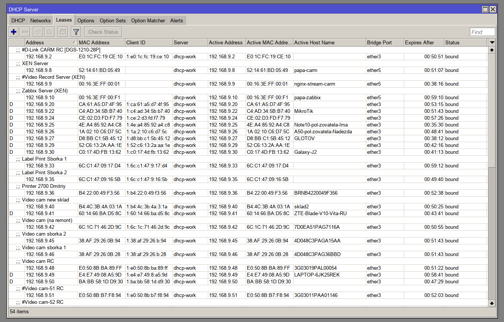
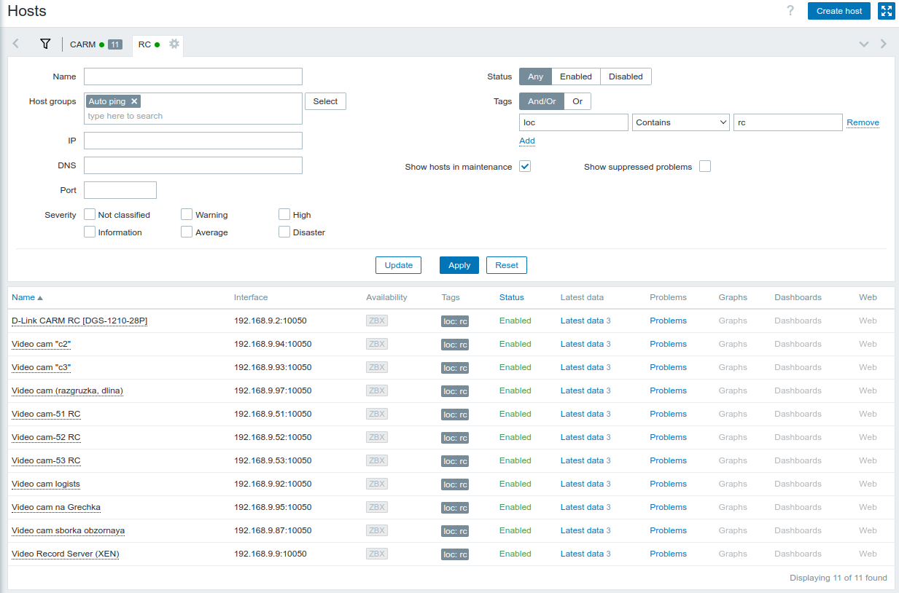
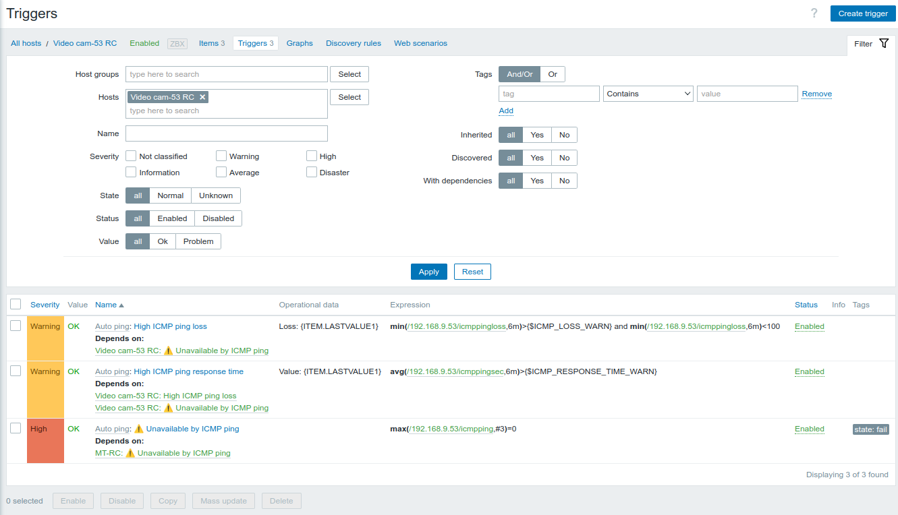

**Problem to solve:**
- Monitor selected hosts via Zabbix (ICMP or another template)
- Make it easy !

**Environments:**
- Mikrotik with RouterOS > 7.x
- Zabbix server

**Solution:**
- Add Mikrotik to Zabbix
- All hosts that we want to monitor - DHCP clients
- On Mikrotik make static IP (DHCP Server -> Leases) interested host
- Add comment start with #
- Run script 
- That's all !

**Details:**
- Work with Mikrotik via REST API (implemented to RouterOS started from 7.1), don't forget generate self-signed cert for SSL
- All core mikrotik hosts in file _data/mt_hosts.json_
- Another files in dir _data/_ will be auto generate
- `parent_trigger` - ICMP unnavigable trigger ID for core mikrotik (if no access to mikrotik - no alarms create for monitored hosts)
- set `ZABBIX_TEMPLATE_ID` and `ZABBIX_GROUP_ID` for new discovered hosts
- For delete host from Zabbix - remove comments (or only #) on Mikrotik
- Recommend add script to cron ( 0 */6 * * * /path/to/script.py)

